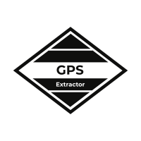

<p align="center"></p>

GPS Extractor takes a collection of images, extracts any GPS data from
them, and writes it out to the format of your choice.

# Installation

# Usage

```
go run . --target ./images --output image_data.csv
```

## Supported Output Formats

* `csv`
* `html`
* `table`
